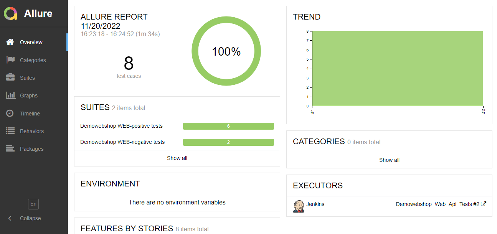
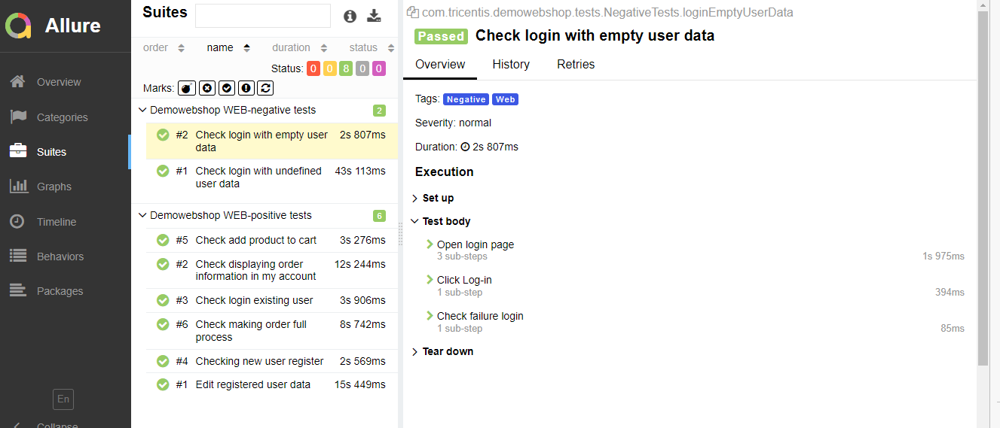
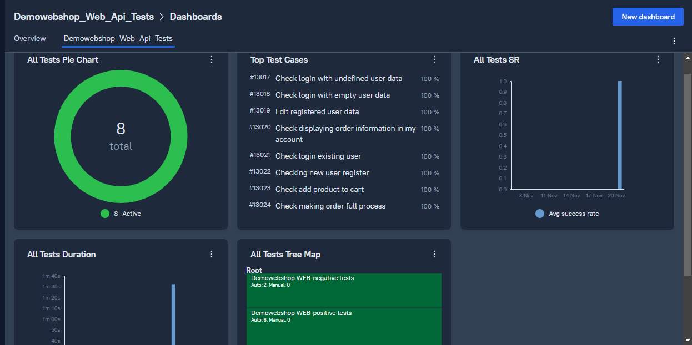
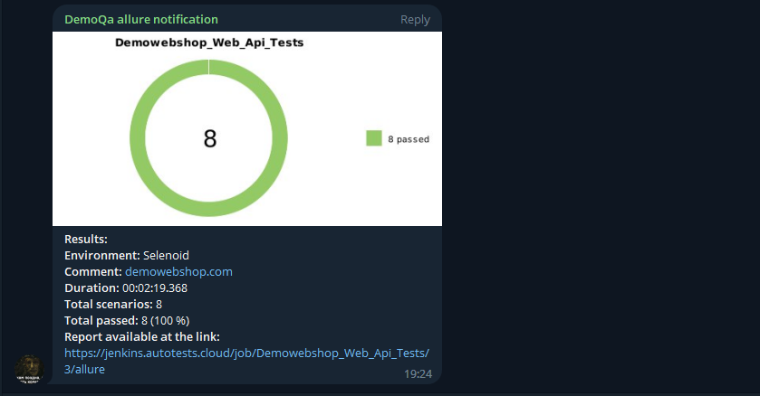
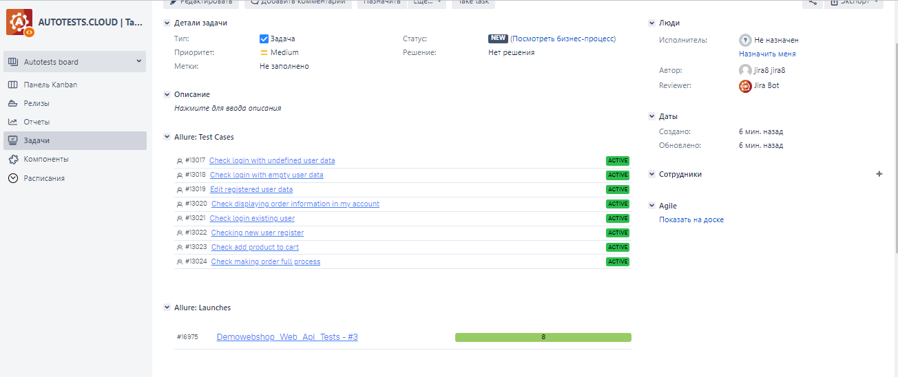

# Demonstration test automation project for Demowebshop.com 


## Content

> ➠ [Covered functionality](#tshirt-covered-functionality)
>
> ➠ [Technology stack](#abacus-technology-stack)
>
> ➠ [Running tests from the terminal](#Running-tests-from-the-terminal)
>
> ➠ [Test results report in Allure Report](#scroll-main-page-of-allure-report)
> 
> ➠ [Tests suits in Allure Report](#scroll-main-page-of-allure-report)
> 
> ➠ [Test-run report in Allure Test Ops](#scroll-main-page-of-allure-report)
> 
> ➠ [Dashboard page of Allure Test Ops](#scroll-main-page-of-allure-report)
> 
> ➠ [Test results report in Allure Report](#scroll-main-page-of-allure-report)
> 
> ➠ [Telegram notification bot](#scroll-main-page-of-allure-report)
> 
> ➠ [Jira integration with Allure Test Ops](#scroll-main-page-of-allure-report)
> 
> ➠ [An example of running a test in Selenoid](#scroll-main-page-of-allure-report)

## :tshirt: Covered functionality

> Autotests developed <code>WEB + API</code>.

### Web + API

- [x] Checking new user register (Get new token and user registration with API) 
- [x] Edit registered user data (Get new token and user registration with API) 
- [x] Check add product to cart (Get new token, user registration, add product to cart with API) 
- [x] Check login existing user
- [x] Check making order full process (Get new token, user registration, add product to cart with API) 
- [x] Check displaying order information in my account (Get new token, user registration, add product to cart with API) 
- [x] Check login with undefined user data
- [x] Check login with empty user data


## :abacus: Technology stack

<p align="center">


</p>

In this project, autotests are written in <code>Java</code> with <code>Selenide</code> and <code>Rest Assured</code> for API tests.

> <code>Owner</code> library provide test data.
>
> <code>Allure Report</code> generates a test run report.
> 
> <code>Gradle</code> is used for automated project build.
>
> <code>JUnit 5</code> is used as a unit testing library.
>
> <code>Jenkins</code> runs the tests.
>
> <code>Selenoid</code> runs <code>Docker</code> container for remote launch tests.
>
> <code>Allure TestOps</code> form test-case's suits and dashboard and link selected test-cases and launches to <code>Jira</code> task.
>  
> After tests launch notification send to <code>Telegram</code> bot>.

## Running tests from the terminal

### :desktop_computer: Running Tests Locally

```
gradle clean all_test - run positive and negative tests
gradle clean positive_test - run  only positive tests
gradle clean negative_test - run  only negative tests

```

### :desktop_computer: Remote test running

```
clean
${TASK}
-Dselenide.remote= remote Selenoid server address
-Dbrowser_size=${BROWSER_SIZE}
-Dbrowser_name=${BROWSER_NAME}
-Dbrowser_version=${BROWSER_VERSION}
```
### :desktop_computer: Add file <code>credentials.properties</code> with data below
```
user.email=brian.legros@gmail.com
user.password=o6sypb4s55y
sample.email=sample@gmail.com
sample.password=45631

deliver.country=United States
deliver.city=Minsk
deliver.state=Alaska
deliver.zip=2353456
deliver.address=Alaska Lenin st 12 b.5
deliver.phone=486555


```
###  Main page of <code>Allure-report</code>

<p align="center">

</p>

###  Suites page of <code>Allure-report</code>

<p align="center">

</p>

###  Main page of <code>Allure TestOps</code>

<p align="center">

</p>

###  Dashboard page of <code>Allure TestOps</code>

<p align="center">

</p>


### Notification <code>Telegram</code> bot

>After each launch telegram bot send tests report and allure report link.

<p align="center">

</p>

###  <code>Jira</code> integration with <code>Allure TestOps</code>

> Jira issue with linked test-cases and Allure Test Ops launches

<p align="center">

</p>

###  An example of running a test in <code>Selenoid</code>

>A video is attached to each test in the report. One of these videos is shown below.

<p align="center">
  
</p>
